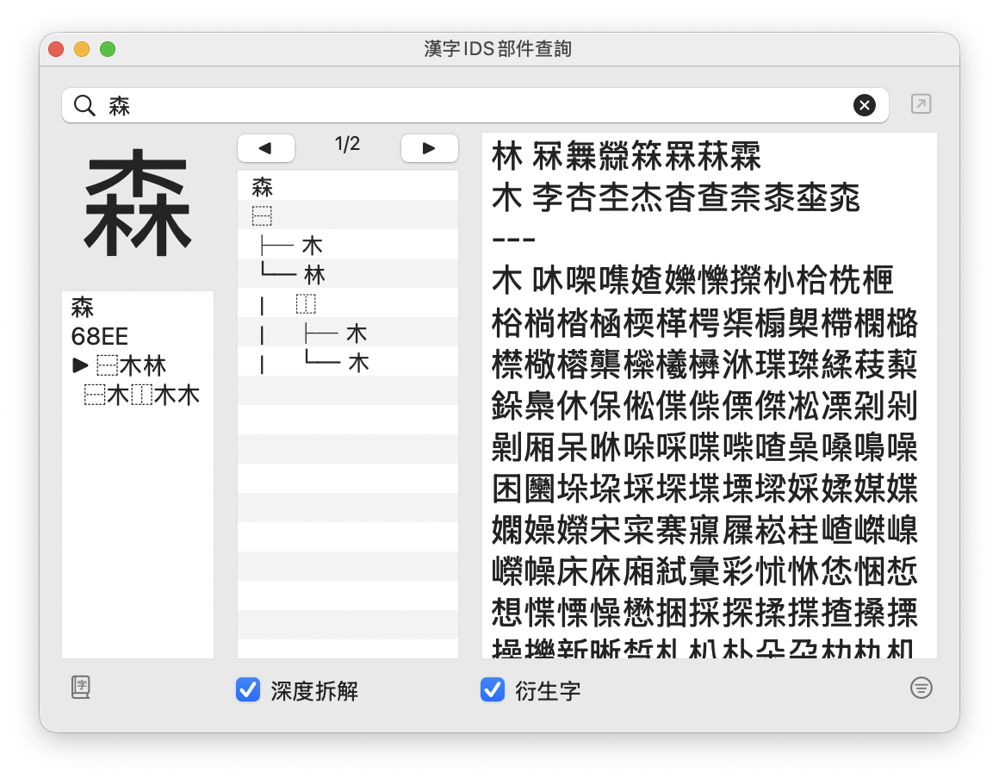

[繁體中文](#漢字-ids-部件查詢) | [English](#hanzi-ids-component-explorer)

---

# 漢字 IDS 部件查詢

Glyphs 字型編輯器外掛，用於拆解漢字結構並查詢相關字符。

## 功能

- **字符拆解** — 輸入漢字，視覺化顯示其部件樹狀結構
- **同字根查詢** — 找出與本字結構相同的關聯字
- **衍生字查詢** — 找出以本字為部件的衍生字
- **字集篩選** — 預設顯示字型檔內的字，亦可使用自訂字集
- **顏色篩選** — 依 Glyphs 顏色標籤過濾結果
- **全字庫連結** — 一鍵查詢 CNS11643 全字庫資料

## 安裝

### 外掛程式管理員（推薦）

1. *視窗 > 外掛程式管理員*
2. 搜尋「HanziIDSComponentExplorer」
3. 點擊 *安裝*
4. 重新啟動 Glyphs

### 手動安裝

下載 `HanziIDSComponentExplorer.glyphsPlugin`，雙擊安裝。

## 使用方式

1. *視窗 > 漢字 IDS 部件查詢* 開啟視窗
2. 在搜尋欄輸入漢字（如「森」）或 Unicode（如「68EE」）
3. 查看拆解結果、同字根、衍生字

## 系統需求

- Glyphs 3.0 或以上
- macOS 10.9 或以上

## 資料來源

IDS 資料來自 [CHISE IDS database](https://www.chise.org/ids/) 的 CNS 及 Unicode 資料，收錄 98,662 個字符。

## 授權

Apache License 2.0 — 詳見 [LICENSE](LICENSE)

## 作者

**殷慈遠 TzuYuan Yin** — [erikyin.net](https://erikyin.net)

## 致謝

- [CHISE Project](https://www.chise.org/) — IDS 資料庫
- [全字庫](https://www.cns11643.gov.tw/) — 字形資料參考
- [3type/EOD 拆字小組](https://github.com/3type/EOD) — 資料格式啟發

---

# Hanzi IDS Component Explorer

A Glyphs font editor plugin for decomposing Chinese characters and exploring related glyphs.

## Features

- **Character Decomposition** — Visualize the component tree structure of any Chinese character
- **Sister Characters** — Find characters sharing the same structure
- **Derived Characters** — Find characters using this character as a component
- **Charset Filtering** — Filter by current font glyphs or custom charset
- **Color Filtering** — Filter by Glyphs color labels
- **CNS Link** — Quick lookup in CNS11643 database

## Installation

### Plugin Manager (Recommended)

1. *Window > Plugin Manager*
2. Search for "HanziIDSComponentExplorer"
3. Click *Install*
4. Restart Glyphs

### Manual Installation

Download `HanziIDSComponentExplorer.glyphsPlugin` and double-click to install.

## Usage

1. Open *Window > HanziIDSComponentExplorer*
2. Enter a Chinese character (e.g., "森") or Unicode (e.g., "68EE")
3. View decomposition, sister characters, and derived characters

## Requirements

- Glyphs 3.0+
- macOS 10.9+

## Data Source

IDS data from [CHISE IDS database](https://www.chise.org/ids/) (CNS and Unicode), covering 98,662 characters.

## License

Apache License 2.0 — See [LICENSE](LICENSE)

## Author

**TzuYuan Yin** — [erikyin.net](https://erikyin.net)

## Acknowledgments

- [CHISE Project](https://www.chise.org/) — IDS database
- [CNS11643 全字庫](https://www.cns11643.gov.tw/) — Glyph data reference
- [3type/EOD](https://github.com/3type/EOD) — Data format inspiration

---

Copyright 2026 TzuYuan Yin
